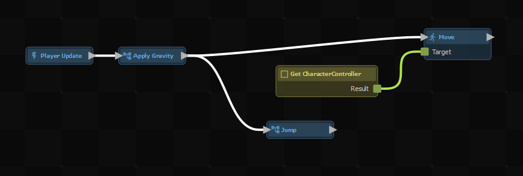
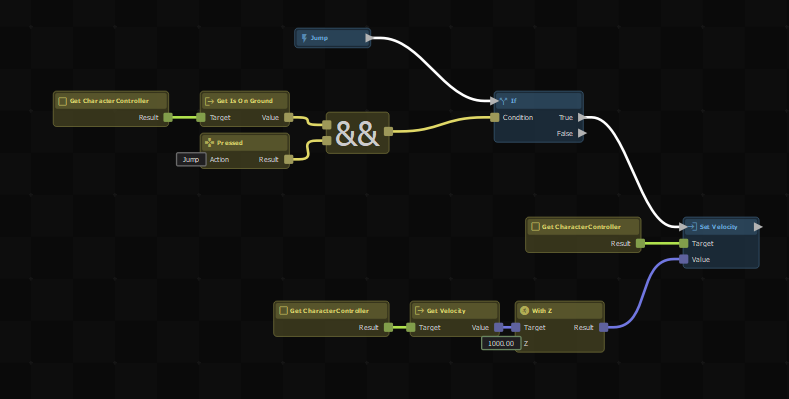

# Action Resources

You can create your own nodes by making a `.action` game resource.

First select a bunch of nodes that do whatever you want your new node to do, then right-click and select *Create Custom Node…*

The button won't appear if it's not possible to split the selected nodes from the current graph, for example if you've selected the root node.

You'll then get a dialog to save your new node to a file.

After clicking *Save*, you'll see the selected nodes have been replaced by a new single node with the name you chose.

You can double-click on a custom node to open it in the editor. You'll see a root node was created for you, and if your selection had any out-going links there will be an output node too.

