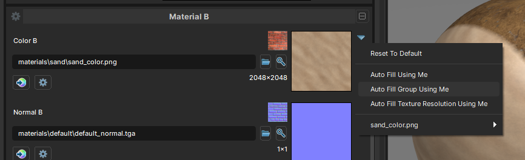

# Texture Naming

The editor can automatically assign the textures in a Material as long as they follow the naming conventions below.

| **Texture Type**               | **Suffix** |
| ------------------------------ | ---------- |
| Base Color / Albedo / Diffuse  | _color     |
| Normal Map                     | _normal    |
| Roughness                      | _rough     |
| Metallic                       | _metal     |
| Ambient Occlusion              | _ao        |
| Opacity / Alpha / Transparency | _trans     |
| Emissive / Self Illumination   | _selfillum |
| Tint Mask                      | _mask      |
| Blend Mask                     | _blend     |
| Height                         | _height    |

For example:
`sand_color.png`, `sand_normal.png`, `sand_rough.png`

:::info
These suffixes are defined by the shader. Custom shaders may use different naming conventions.
:::

Right-click a texture in the Asset Browser and select **Create Material**. Any textures with a matching base name (e.g. `sand`) will be assigned automatically.

You can also use **Auto Fill** in the Material Editor to save some time. Assign one texture and it will populate the remaining slots automatically.

