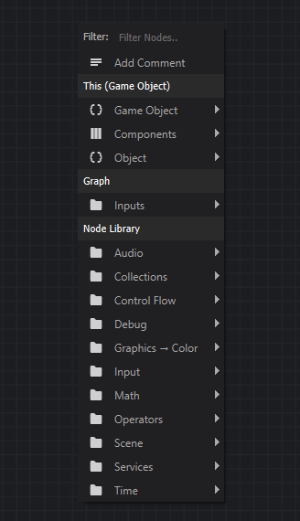
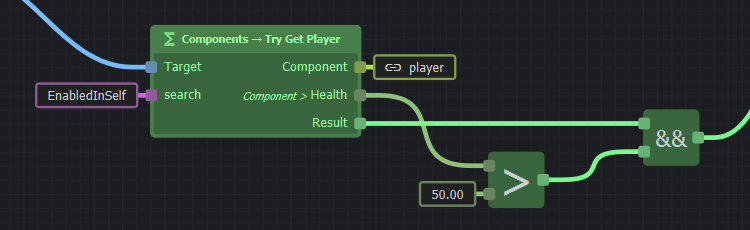
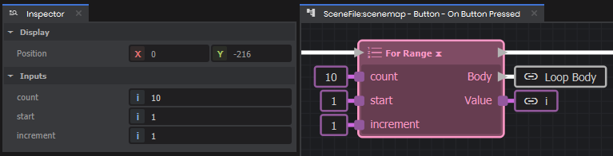

# Intro to ActionGraphs

ActionGraph is a visual scripting language. Each node describes an action or expression, and links between nodes carry values or signals.

## Creating a new ActionGraph

To start using ActionGraph in your project, you can either:

* [Use the built-in Component actions](/editor/actiongraph/component-actions.md)
* Use the Component Editor to create methods in a custom component
* [Add a Delegate-type property to a custom component in C#](/editor/actiongraph/using-with-c.md)

Following either guide above will get you into the ActionGraph editor.

## Nodes

Nodes appear as rectangles in the ActionGraph editor with a name (or symbol), and input or output sockets. You create a node by right-clicking in any empty space, or dragging a link from an output to get a list of possible nodes that are specific to the link value type.

###  Root Node

The root node is the entry point of your graph. It'll be the only node in a new graph, and can't be deleted. It has only output sockets: one signal socket at the top, and optionally some value sockets if your graph accepts parameters.

When the graph runs, a signal is fired from the output signal socket of your root node. This will follow any links to other action nodes, causing them to run too.

### Expression Nodes

Expression nodes (green) perform a calculation based on their inputs, without changing any state elsewhere. They don't have any input or output signal sockets, and will evaluate when any of their output values are used by another node.

### Action Nodes

Action nodes (blue) are any nodes with the white, arrow-shaped signal sockets. These nodes trigger things to happen when receiving a signal.

Most action nodes will have one input and one output signal socket in their title bar. The input will trigger the node to run, and the output will fire when the node has finished performing its action.

Some control flow nodes like *If*, *While*, *For Each*, or *For Range*, will have extra output signal sockets that will fire if certain conditions are met. This allows you to do loops, or branch based on some condition.

## Links

Links connect an output of one node to an input of another. A link between signal sockets (white, arrow-shaped) will carry a signal, and any other link will carry a value. Links are created by dragging from a node's output.

If your graph is becoming messy because of links travelling a long distance, you can use variables to help clean things up. You can also use reroute nodes (shift-click on an existing link) to help organize your links.

Your graph can't be linked in a way that leads to a cycle: it shouldn't be possible to follow links from outputs to inputs and arrive back at the same node. You can use special action nodes in the *Control Flow* category to perform loops, rather than trying to connect your nodes in a cycle with links.

## Constants

If you want to use a hard-coded value in an input, you can directly set it in the *Properties* panel when the node is selected.

## Next Steps

Now you know the basics, the next things to learn are:

* [How to use variables](/editor/actiongraph/variables.md)
* [Creating your own custom nodes](/editor/actiongraph/custom-nodes/index.md)
