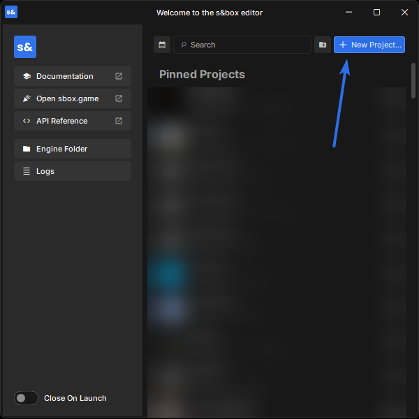
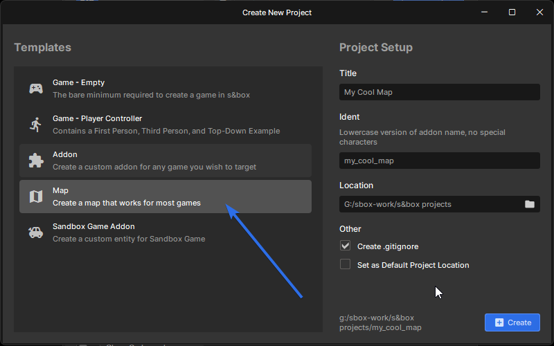
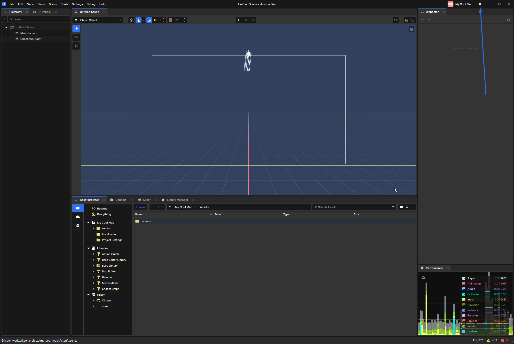
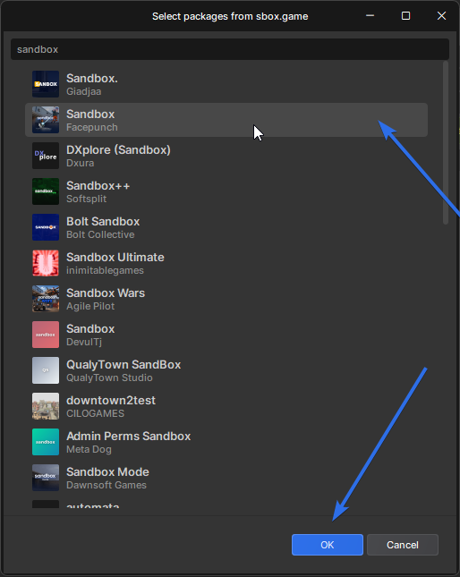
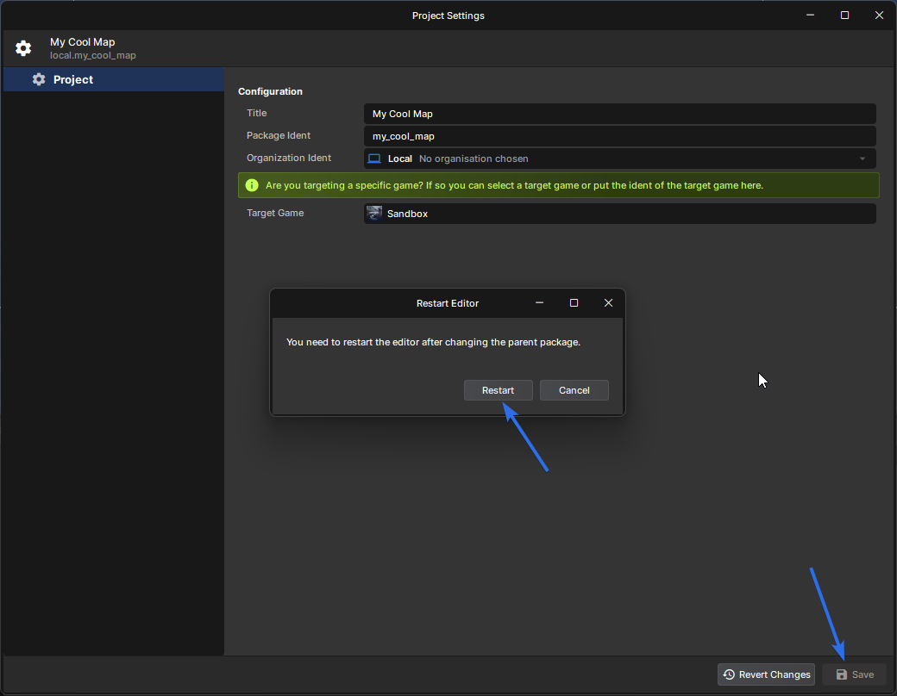
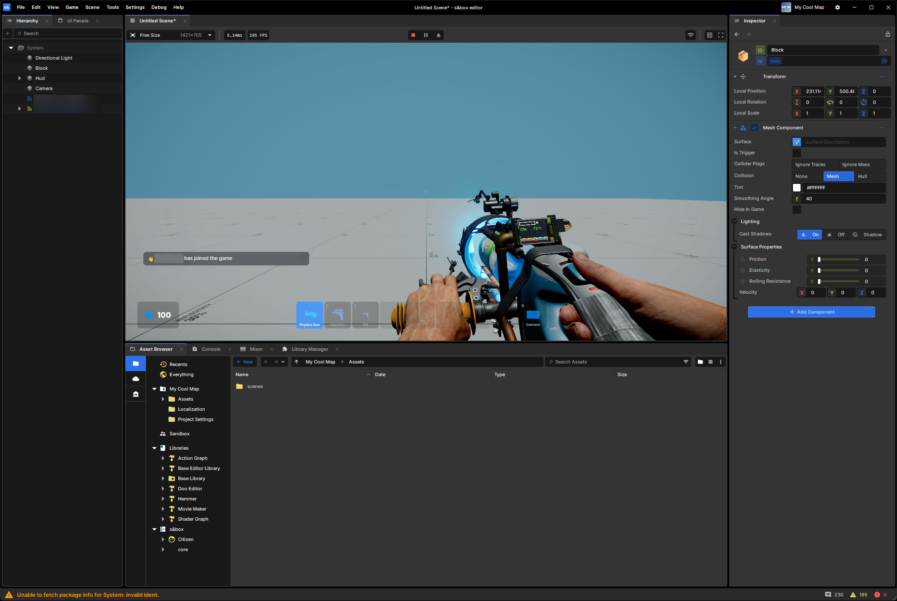
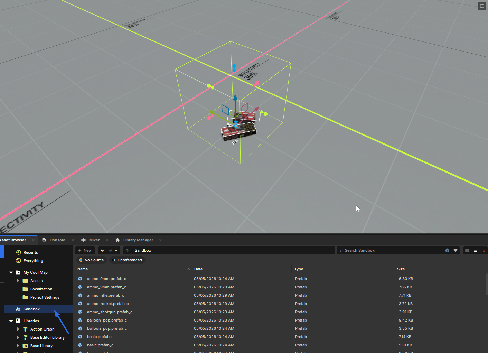

# Mapping For Games

## Setting up a project

This guide shows how to set up a map project so mappers can build maps for a specific game. In this example, we target Sandbox.

1. Open the editor and click **New Project**.

2. In the template list, select **Map**.
3. Set your project **Title**, **Ident**, and **Location** path, then create the project.

4. After the editor loads, click the **cog** icon in the top-right to open **Project Settings**.

5. Find **Target Game** and click it. In the popup, select **Sandbox** (or any game you want to target), then click **OK**.

6. Back in **Project Settings**, confirm the target game is set, then click **Save**.
7. Confirm the restart prompt. The editor needs to restart to apply the parent package change.

8. When the editor opens again, press **Play**. You should now be playing inside Sandbox from your map project.

:::info
You may need to remove the camera in your scene before testing, this is because most games will spawn their own camera in.

:::

## Using game components and prefabs

Some games ship with their own components and prefabs, such as ammo pickups.

To find them, open the **Asset Browser**, then find and select the folder for the game you are targeting (for example, **Sandbox**). From there, you can browse and place those game-specific assets into your map.

