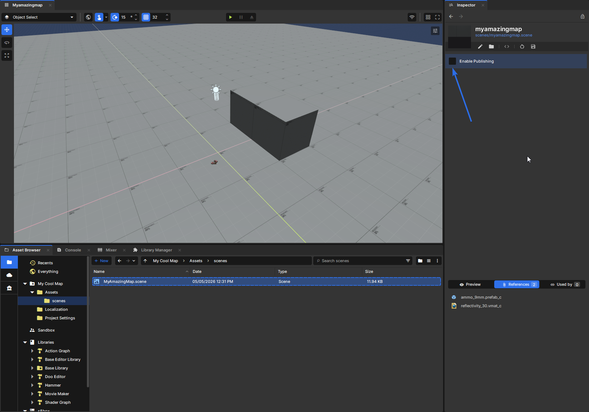
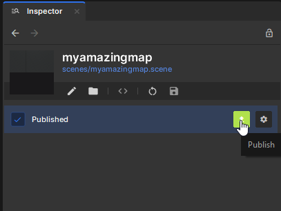
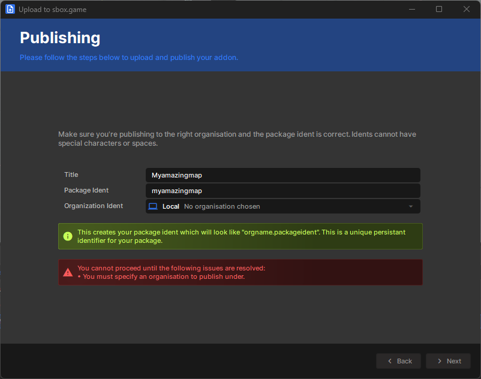
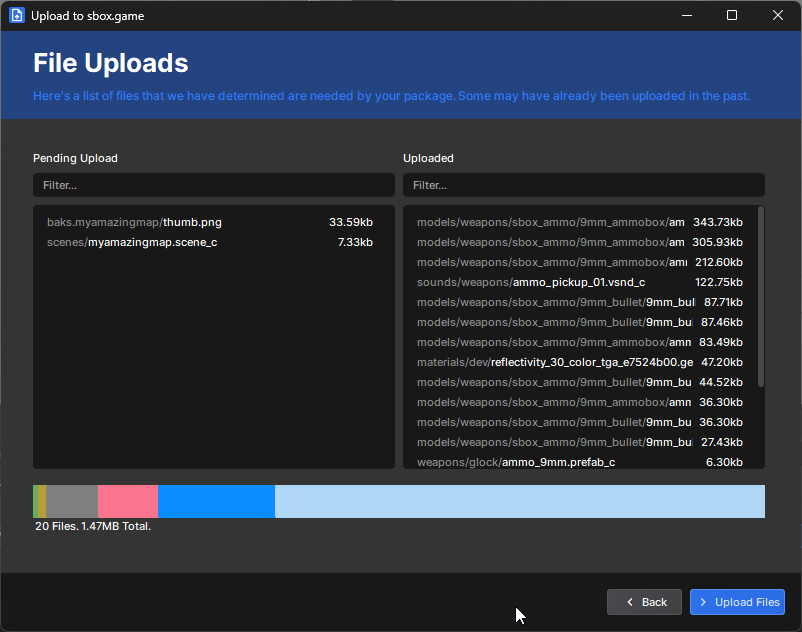
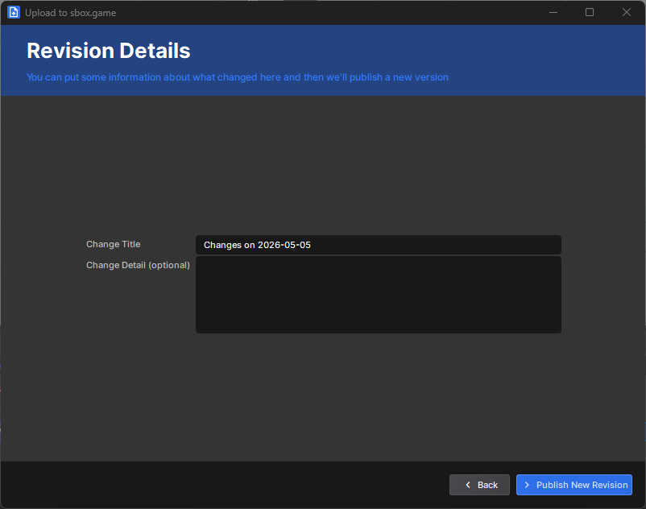
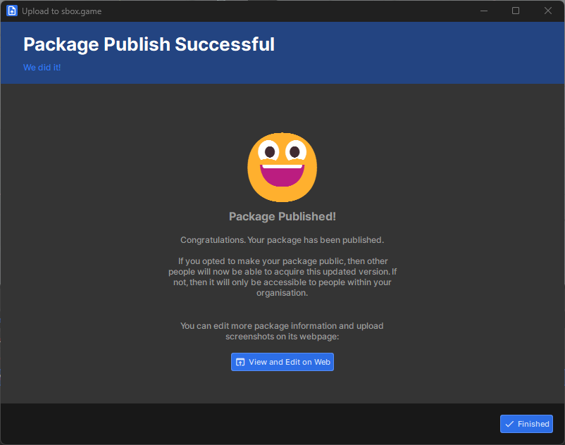
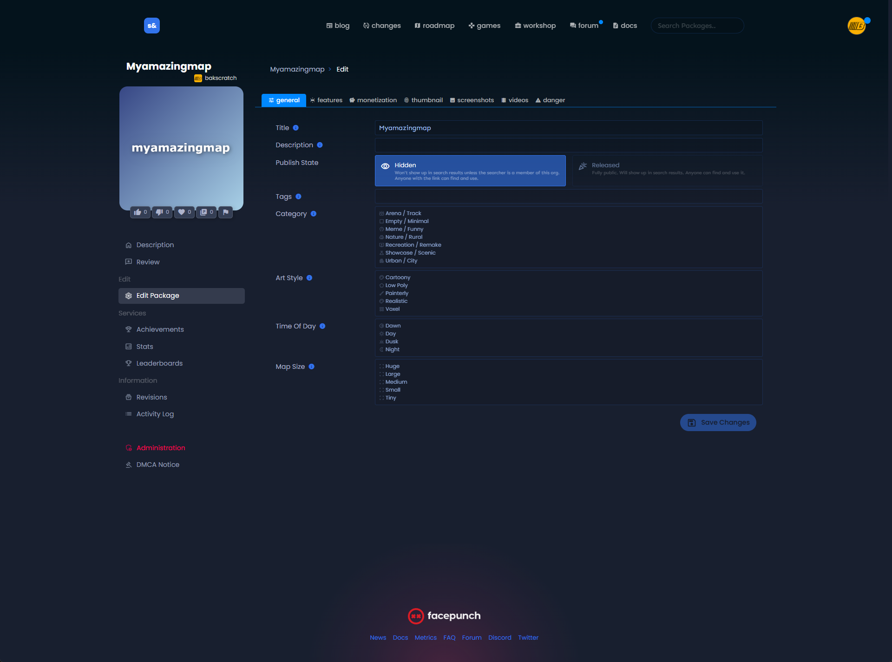

# Publish

Once your map is ready to share, you can upload it so other players can download and play it. This page covers the basic publishing so that other players can play your creation.

## Publishing your map

1. In the **Asset Browser**, select your scene file. When it is selected, its settings will appear in the **Inspector**.
2. In the inspector, enable publishing by clicking the **Enable Publishing** checkbox.

3. After enabling publishing, two buttons will appear. For now, click the green **Publish** button.

4. This opens the publishing window. Enter a **title**, choose an **ident**, and select an **organization**.

:::info
Your **ident** cannot be changed later, so choose it carefully.
:::

5. If you do not already have an organization, you will need to create one before publishing.

6. Once all of the information is filled in, click **Next**. This takes you to the file upload step.
7. Here you can see what is being uploaded and what is being referenced. Files listed under uploaded are already on the cloud.
8. Click **Upload Files**.

9. The next page is the revision page. Fill it in however you like, then click **Publish New Revision**.

10. After that, you should see a confirmation screen showing that the package was published successfully.
11. For a first-time upload, click **View and Edit on Web**.
12. Your map is now uploaded.

## On the web

To make your map public to everyone, change the **Publish State** to **Released**.

## Editing your map page

On the website, you can continue editing your map details. This includes the **title**, **description**, **tags**, **categories**, as well as adding a **thumbnail** and **screenshots**.

Once published, your map should appear in game and in the cloud asset browser for other people to find and play.
