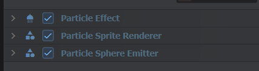
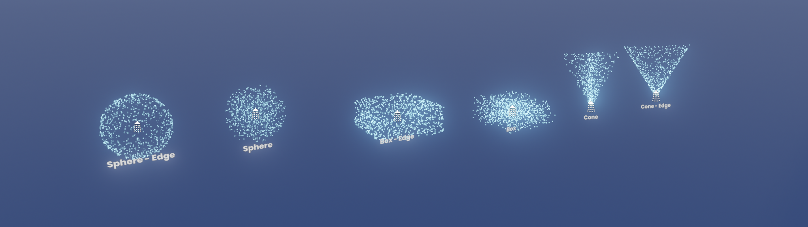

# Particle Effect

The scene system includes a programmable particle system, which can be controlled completely with components.

# About Particle Effect

Our particle system is designed to be controllable. It simulates purely on the CPU, but is heavily multithreaded. Our decision was to enable ease of use and make it fully programmable, rather than simulate on the GPU in a way that would make that difficult.

With this system you can emit particles manually, in code, one by one. You can iterate the particles and change their values at any time. You can write a controller that will fully control the particle on simulate. You can react to particles colliding with the world.

# Parts of a Particle Effect

To maximize flexibility and encourage an open, extendable system, a particle systems is created from multiple components.

## ParticleEffect

This is the base effect. This holds a list of particles and ticks them.

On this component you can set common variables like the maximum amount of particles it's allowed to contain, and the lifetime of the particle. There are also a bunch of optional features built in, like force and collision.

## Renderer

The thing that renders the particles is a separate component. The most common component here is the `ParticleSpriteRenderer` - which simply renders the particle as a camera facing sprite.

## Emitter

Without an emitter the particles won't exist. The emitter defines the amount of particles to spawn, in a burst or over time.

You can operate without one of the built in emitters, if you intend to call `ParticleEffect.Emit` manually, to create particles in a more bespoke way.
