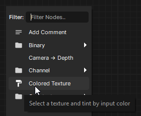
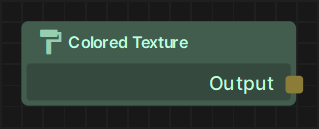
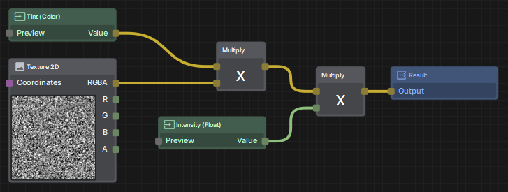
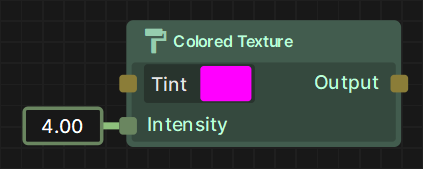
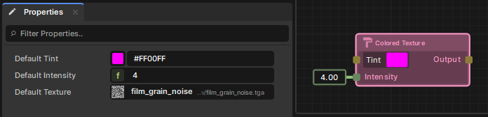

# Creating a Subgraph

Subgraphs are a collection of Shader Graph nodes that can be easily reused as a single node across other Shaders and even other Subgraphs. This is an easy way of develop custom Shader Graph Functions of your own.

# Creating a Subgraph

You can create an empty Shader Graph Function by creating a new Asset and selecting Shader -> Shader Graph Function

You can also create a Shader Graph Function from pre-existing nodes in a graph by selecting them all, right clicking, and selecting "Create Custom Node"

# Subgraph Properties

When no nodes are selected, you can edit the properties of the Subgraph itself, including it's Name, Description, Icon, and whether or not it should appear in the Node Library (If not, the node will not appear in the right click menu or the Palette)

 

# Creating Outputs

Every Subgraph has a "Result" node, which is similar to the "Material" output node from regular Shader Graphs. However in a Subgraph you can define as many outputs as you want via the Properties panel, and can even choose which outputs to display in the Preview tab.

# Creating Inputs

To create an input that is exposed on the resulting Subgraph Node, you can create a "Subgraph Input" node,

Setting "Is Required" to true will not pre-populate a default value, and will instead require you to connect another node for the Graph to compile.

Order is used to ensure the correct order of the inputs on the left side of the resulting node.

# Using Textures

Any Texture nodes that are used in a Subgraph MUST be named in order to compile, as they cannot (currently) be baked with the shader. This is because any Material made using this shader needs to define any Textures used, and whoever is using your shader might not have the referenced Texture.

When using a Subgraph Node, the default Texture can be changed via the Properties tab, alongside the unrequired Inputs.

