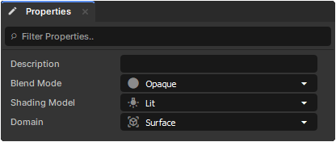

# Properties

There are a few basic properties that each Shader Graph has that affect the way the resulting Shader is drawn and how it can be used.

# Blend Mode

Determines whether or not the Shader should support Opacity, and how it should be handled.

* Opaque - Always full opacity, no support for transparency.
* Masked - No transparency support, but will use dithering with anything in-between 0 and 1.
* Translucent - Full transparency support, allows you to see-through any opacities between 0 and 1.

# Shading Model

Determines whether or not the Shader should be affected by lighting.

* Lit - Light will affect the material and can support Emissions, Normals, Roughness, Metalness, and Ambient Occlusion.
* Unlit - The material will output the raw colour to the screen regardless of the lighting in the Scene.

# Domain

Determines how/where the shader should be used.

* Surface - Used for any materials that will be used on 3D Objects placed within your scene. Can have a set Shading Model.
* Post Process - Used for post-processing materials that will be applied to the screen. Uses Screen Coordinates instead of Texture Coordinates.
