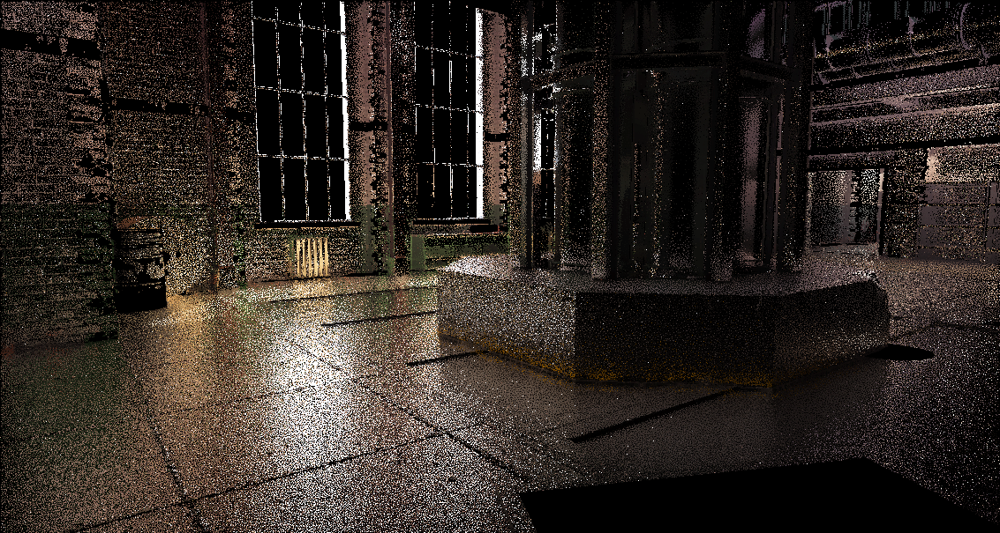
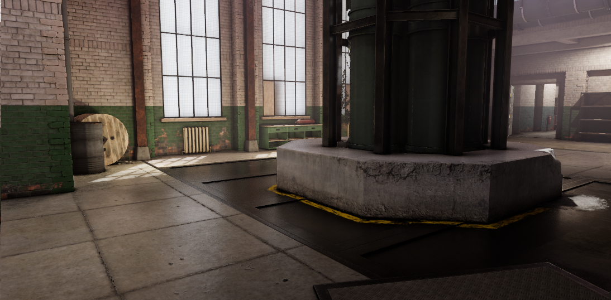

# Screen-Space Reflections

SSR is done in three steps

* Intersection
  * Uses the [G-Buffer] and [Screen Space Tracing] right after we do the Depth Pre-Pass, uses the result from last frame reprojected with [Motion]
  * 
* Denoising
  * Accumulates the result and makes it pretty taking off the rough edges
  * 
* Compositing
  * Sets the texture to be composited with [Dynamic Reflections]
  * 
